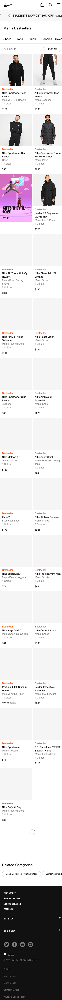
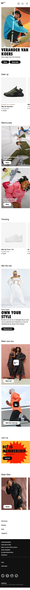
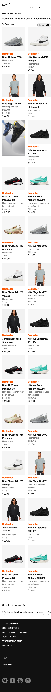

# Procesverslag
Markdown is een simpele manier om HTML te schrijven.  
Markdown cheat cheet: [Hulp bij het schrijven van Markdown](https://github.com/adam-p/markdown-here/wiki/Markdown-Cheatsheet).

Nb. De standaardstructuur en de spartaanse opmaak van de README.md zijn helemaal prima. Het gaat om de inhoud van je procesverslag. Besteedt de tijd voor pracht en praal aan je website.

Nb. Door *open* toe te voegen aan een *details* element kun je deze standaard open zetten. Fijn om dat steeds voor de relevante stuk(ken) te doen.

## Jij

uitwerken voor kick-off werkgroep

### Auteur:
Rens Westerveld

#### Je startniveau:
Rood

#### Je focus:
Responsive
 

## Je website

uitwerken voor kick-off werkgroep

### Je opdracht:
https://www.nike.com/nl/

#### Screenshot(s) van de eerste pagina (small screen): 
hier de naam van de pagina  

#### Screenshot(s) van de tweede pagina (small screen):
hier de naam van de pagina  

 

## Breakdownschets (week 1)

Deze week ben ik begonnen met mijn breakdown van de homepage en heb ik een start gemaakt met de opzet van de homepage in Html.

### de hele pagina: 

## Voortgang 1 (week 2)

Ik heb alle content van mijn eerste pagina in HTML gezet en ik heb de CSS voor +-80% af.

### Stand van zaken
Alle content toevoegen en de opdeling van de site ging heel goed. Ik had dit redelijk snel klaar en het klopt ook. Wel had ik
 een tijd moeite met de grootte van mijn afbeeldingen in mijn "li" items. Deze werden maar niet groter, maar dit heb ik opgelost.
 Het positioneren van links over een foto heen lukt mijn niet omdat een flexbox geen "a" in een "a" ziet. Waardoor mijn link knop
 niet wordt opgenomen in de flexbox over de afbeelding heen.

### Verslag van meeting
hier na afloop snel de uitkomsten van de meeting vastleggen

Ik was ziek en heb dit voortgangsgesprek niet gehad. Wel heb ik in de les mijn werk laten zien. Mijn eerste pagina zag er al goed
 uit en er was vertrouwen dat de rest goed zou komen.

## Voortgang 2 (week 3)

Begonnen aan 2e pagina en hamburgermenu

### Stand van zaken
Ik had moeite met het maken van mijn hamburger menu. Hier had ik wat oefening en tijd voor nodig om hem uiteindelijk werkend te krijgen. 
 Hopelijk heb ik gebruik gemaakt van de juiste html.
 
 Ik ben begonnen aan mijn 2e pagina. Omdat ik wil oefenen met grid heb ik gekozen voor de meest verkochte heren producten pagina. Alleen
 nu kom ik met de css van de eerste pagina in de knoop. Hier moet ik dingen over vragen.

### Verslag van meeting
hier na afloop snel de uitkomsten van de meeting vastleggen

- Ik was al goed op weg en had de basis al goed staan
- Ik moest nog wat HTML en CSS foutjes verbeteren
- Verder gaan met Surface plane en Responsive

## Toegankelijkheidstest (week 4)

uitwerken na test in 8e voortgang

### Bevindingen
Lijst met je bevindingen die in de test naar voren kwamen:

#### Titel eerste bevinding
Hier korte omschrijving (met indien nodig een afbeelding)

Hier een omschrijving van hoe het opgelost kan worden (met indien nodig een afbeelding)

#### Titel tweede bevinding. 
Hier korte omschrijving (met indien nodig een afbeelding)

Hier een omschrijving van hoe het opgelost kan worden (met indien nodig een afbeelding)

#### Titel volgende bevinding. 
Hier korte omschrijving (met indien nodig een afbeelding)

Hier een omschrijving van hoe het opgelost kan worden (met indien nodig een afbeelding)

#### Titel nog een bevinding. 
Hier korte omschrijving (met indien nodig een afbeelding)

Hier een omschrijving van hoe het opgelost kan worden (met indien nodig een afbeelding)

## Voortgang 3 (week 4)

uitwerken voor 3e voortgang

### Stand van zaken
Ik heb mijn 2 pagina's "af". De HTML en CSS staan. Ik heb geprobeerd om de site zo responsive mogelijk te maken en zoveel mogelijk dingen toe
 te voegen aan de surface plane.

 
 
 
 

### Agenda voor meeting
samen met je groepje opstellen

| student 1      | student 2          | student 3    | student 4        |
| ---            | ---                | ---          | ---              |
| dit bespreken  | en dit             | en ik dit    | en dan ik dat    |
| en dat ook nog | dit als er tijd is | nog een punt | dit wil ik zeker |
| ...            | ...                | ...          | ...              |

### Verslag van meeting
hier na afloop snel de uitkomsten van de meeting vastleggen

- punt 1
- punt 2
- nog een punt
- ...

## Eindgesprek (week 5)

uitwerken voor eindgesprek

### Stand van zaken
hier dit ging goed & dit was lastig (neem ook screenshots op van delen van je website en code)

### Screenshot(s)

hier screenshot(s) van je eindresultaat

## Bronnenlijst

continu bijhouden terwijl je werkt

Nb. Wees specifiek ('css-tricks' als bron is bijv. niet specifiek genoeg).

1. https://www.w3schools.com/tags/ref_pxtoemconversion.asp (omrekenen van PX en EM)
2. https://www.youtube.com/watch?v=qoULWGhiC0w (hamburger menu)
3. ...

